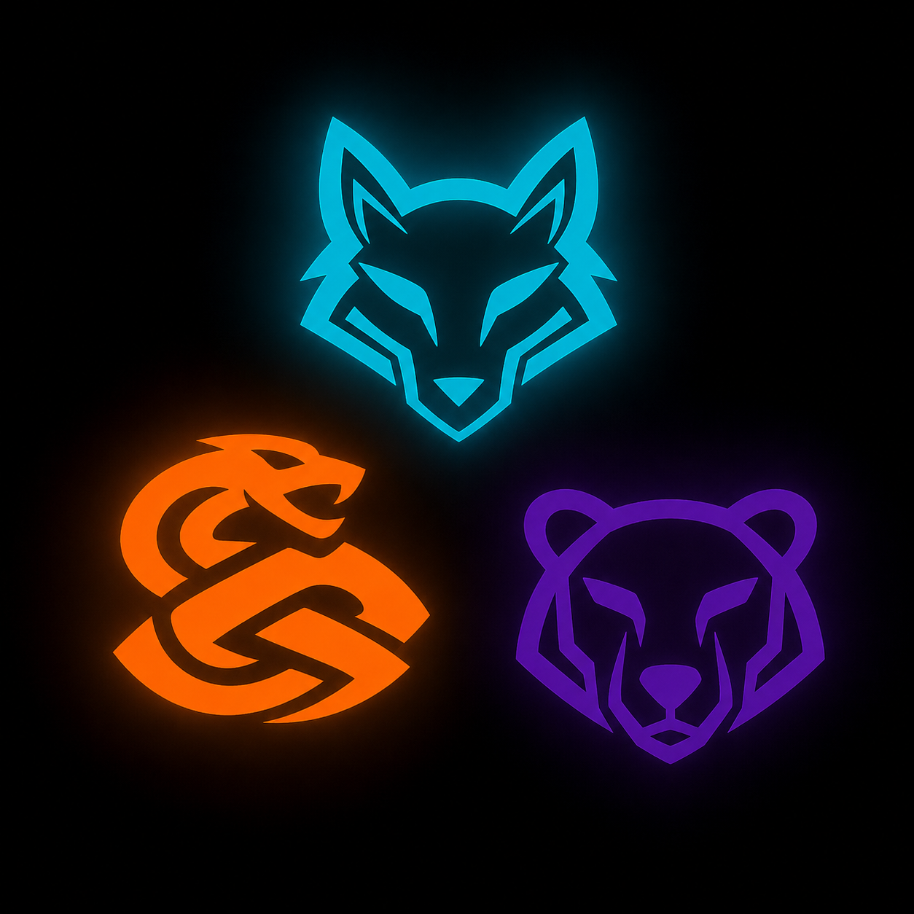

<p align="center">
  
</p>

<h1 align="center">Urlog</h1>

<p align="center">
  Autonomous,  but not opaque, operations layer for production AI systems —<br>
  quality error budgets, burn-rate alerting, eval-gated releases, and audit-grade records.
</p>

---

## Why

Every AI observability tool on the market is a **dev-loop** tool: trace, debug, eval, iterate. Urlog is the **ops loop**: quality SLOs, error budgets, multi-window burn-rate alerting, incident lifecycle, and AI Act Article 12 audit records. Tracing tells you what your agent did. Urlog tells you whether someone should be paged, whether a release should be stopped, which operational action is safe to take, and can execute pre-approved actions as the autonomous operator.

Urlog ingests standard OTLP (OTel GenAI semantic conventions). No proprietary SDK. If your system is instrumented for anything, it is instrumented for Urlog.

The long-term product shape is autonomous operations with explicit boundaries: observe production systems, score risk, gate releases, propose or execute safe maintenance actions, and require human approval for predefined destructive actions. The system is agent-assisted, but the contract stays operational: every action is traceable, scored, gated, and auditable.

## Step 1 — Contracts Before Models

Urlog starts with contracts, not a model choice. The LLM is pluggable and may plan the work, but the system only acts through machine-readable contracts.

For Integration, those contracts live in [`integration/contracts/`](integration/contracts/):

```text
intent -> action exists -> environment allowed -> evidence present ->
risk score calculated -> pre-approval matched -> execute -> verify -> audit
```

The contracts define:

- `action-catalog.yaml`: what actions the autonomous operator may choose.
- `environment-catalog.yaml`: where actions may happen.
- `pre-approval-policies.yaml`: which actions may run without live human approval.
- `risk-scoring.yaml`: how final action risk is calculated.
- `intent.schema.json`: the shape an LLM-planned action must emit.
- `execution-record.schema.json`: the audit record every action must leave behind.

If an action is not in the catalog, it cannot run. If an environment is not listed, it cannot be targeted. If evidence is missing, policy can hold or deny the action. This is how Urlog can be autonomous without being opaque: the LLM proposes operational intent, policy resolves authorization, executors run bounded actions, and Debt records the proof.

## The modules

| Module | Role | What it owns |
|---|---|---|
| **Integration** | Integration | OTLP ingestion, Redpanda consumers, tiered eval workers (classifiers on 100% of traffic, LLM-judge on stratified samples) |
| **Delivery** | Deployment | Quality SLOs, error budgets, multi-window multi-burn-rate alerting, eval-gated releases |
| **Debt** | Troubleshooting | Session forensics, incident lifecycle, hash-chained immutable audit log, AI Act Article 12 retention |
| **Eye** | Reporting | Live reports, evidence indexes, PDFs/docs, report upload connectors, OpenSearch report search |
| **SecFlow** | Security | Third-party security tools: prompt-injection detection, garak evidence, dependency/image/SBOM findings, security gate signals |

The modules are separate systems bound by one contract: the versioned protobuf schema in [`schema/`](schema/). Integration writes it, Delivery reads it to gate, Debt queries it forever, Eye reports on it; SecFlow annotates it with optional security findings. A change that touches two modules without going through the schema is a bug in the change.

In the autonomous-ops loop, those same roles stay intact:

- **Integration** is the integration surface for live operational signals: OTLP ingest, stream consumers, eval workers, and the feed that later powers cloudops/devops automation.
- **Delivery** is the deployment decision layer: SLO math, error budgets, release gates, dependency/library validation signals, and CI readiness checks.
- **Debt** is the troubleshooting and evidence layer: session forensics, incidents, audit records, diagnosis support, and scoring that determines whether proposed interventions are safe or need human approval.
- **Eye** is the reporting and monitor layer: it creates live reports, searchable evidence, PDFs/docs, and customer document-system exports.
- **SecFlow** is optional security assistance: prompt-injection detection, dependency/image findings, security gate signals, and third-party DevSecOps tooling that can be omitted without breaking the core loop.

## Architecture in one paragraph

Spans arrive over OTLP gRPC, buffer through Redpanda, and land in ClickHouse as narrow rows — full prompt/completion payloads live in object storage behind `payload_ref`. The unit of analysis is the **session with a goal-level outcome**, not the request: agent failures are multi-step causal chains and the data model has to admit that. Eval scores are a separate stream joined at query time, each stamped with `evaluator_version`, because judges drift exactly like the systems they judge. Delivery rolls scores into SLIs, tracks the error budget, and gates deploys; Debt keeps the forensic and audit trail; Integration supplies the live stream; Eye can generate reports and SecFlow can add security findings.

## Quickstart (dev)

```bash
git clone <repo-url> && cd urlog
docker compose -f deploy/docker-compose.dev.yml up   # ClickHouse + Redpanda + otel-collector
```

Point any OTel GenAI-instrumented app (OpenLLMetry, OpenInference) at `localhost:4317` and spans start flowing.

## Repository layout

```
schema/    the contract — protobuf, versioned, breaking changes need their own MR
integration/      integration
delivery/    deployment
debt/     troubleshooting
eye/      reporting and monitor
secflow/  optional security flow
deploy/    dev compose stack + Helm chart (EU-first, self-hostable)
assets/    brand — SVG sources of record
examples/  ForgeBoard PaaS sample system
learning/  tutorial tracks for Phase 0 learning
```

## Samples

Open [index.html](index.html) for the current static sample index. It links to Integration, Delivery, Debt, Eye, SecFlow, ForgeBoard, and the Integration learning track.

## Status

Pre-alpha. Design partner #0 is a production LangGraph retrieval system. Follow `ROADMAP.md` for the phase plan and `LOG.md` for the daily build record.

## The name

Norns, wells, and a traded eye — see [about.md](about.md).
